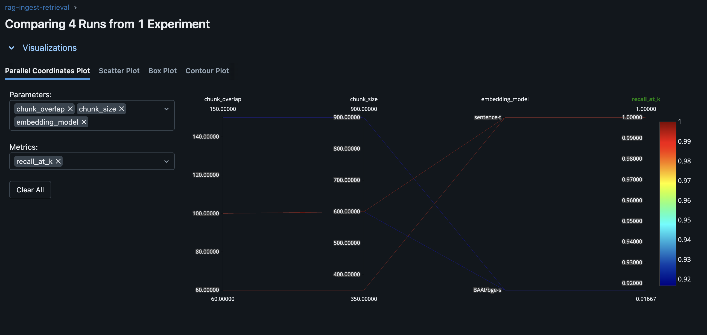
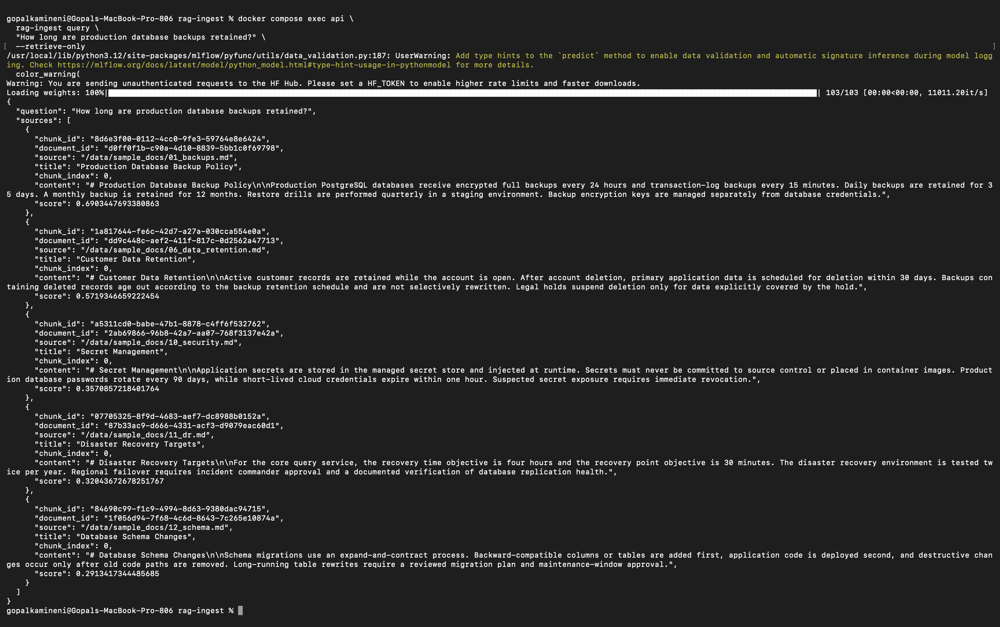
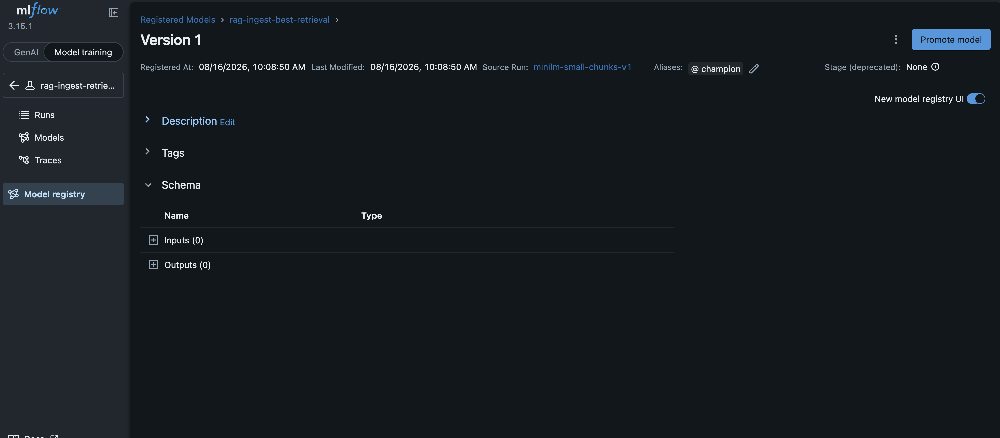

# rag-ingest

A deliberately small RAG backend that demonstrates the ingestion and retrieval pieces that are often hidden behind frameworks: asynchronous embedding jobs, pgvector storage, retrieval evaluation, prompt versioning, and experiment lineage.

## What it includes

- **PostgreSQL + pgvector** for document metadata, chunks, and cosine vector search.
- **Celery + Redis** for asynchronous ingestion/embedding jobs.
- **LangChain** for recursive text splitting and the retrieval → prompt → LLM runnable.
- **MLflow** for retrieval experiments, `recall@k`, MRR, configuration logging, and a registry `champion` alias.
- **Versioned prompts** under `prompts/` and prompt-version logging per experiment.
- **FastAPI + CLI**, no UI.
- **18 small fictional documents** plus a labeled retrieval evaluation set.

The default embeddings are local (`sentence-transformers/all-MiniLM-L6-v2`), so ingestion does not require an API key. Answer generation uses `ChatOpenAI` and requires `OPENAI_API_KEY`; retrieval-only queries work without one.

## Architecture

```text
files -> Celery/Redis -> chunk + embed -> Postgres/pgvector
                                      ^
CLI/FastAPI -> LangChain retriever ---+--> versioned prompt -> LLM
                    |
                    +--> MLflow recall@k / MRR experiments -> registry champion
```

See [`docs/ARCHITECTURE.md`](docs/ARCHITECTURE.md) for the rationale behind the boundaries.

## Run it

Requirements: Docker Desktop / Docker Engine with Compose.

```bash
cp .env.example .env
mkdir -p data
docker compose up --build -d
```

Services:

- API: `http://localhost:8000/docs`
- MLflow: `http://localhost:5001`
- Postgres: `localhost:5432`
- Redis: `localhost:6379`

The first embedding run downloads the configured sentence-transformer model inside the worker container.

### 1. Queue ingestion

```bash
docker compose exec api rag-ingest ingest /data/sample_docs
```

The command returns a Celery task ID. Check it with:

```bash
docker compose exec api rag-ingest task <TASK_ID>
```

Or wait for completion in one command:

```bash
docker compose exec api rag-ingest ingest /data/sample_docs --wait
```

Equivalent API request:

```bash
curl -X POST http://localhost:8000/ingest \
  -H 'Content-Type: application/json' \
  -d '{"path":"/data/sample_docs"}'
```

### 2. Retrieve without an LLM key

```bash
docker compose exec api rag-ingest query \
  "How long are production database backups retained?" \
  --retrieve-only
```

### 3. Run the complete RAG query

Set `OPENAI_API_KEY` in `.env`, restart `api`, then run:

```bash
docker compose up -d api
docker compose exec api rag-ingest query \
  "How long are production database backups retained?"
```

The response includes the answer, prompt version, and retrieved source chunks.

### 4. Run retrieval experiments

```bash
docker compose exec api rag-ingest evaluate --config /app/configs/experiments.yaml
```

The matrix varies chunk size and embedding model. Every MLflow run records:

- embedding model
- chunk size / overlap
- `k`
- prompt version
- `recall_at_k`
- MRR
- a simple selection score (`0.6 * MRR + 0.4 * recall@k`)

The best run is packaged as a small MLflow pyfunc containing the selected retrieval configuration, registered as `rag-ingest-best-retrieval`, and assigned the `champion` alias. This is intentionally a **configuration registry artifact**, not a claim that this project trained a new embedding model.


## Example results

A local evaluation run compared four retrieval configurations across the labeled query set.



The selected configuration used `sentence-transformers/all-MiniLM-L6-v2` with a chunk size of 350, overlap of 60, and `k=5`. It achieved `recall@5 = 1.00` and `MRR = 0.9444` on the included evaluation set.



MLflow registered the selected retrieval configuration as `rag-ingest-best-retrieval` with the `champion` alias.

A retrieval-only query also ranks the relevant backup policy first:



## FastAPI endpoints

| Endpoint | Purpose |
|---|---|
| `GET /health` | Database health check |
| `POST /ingest` | Queue an async Celery ingestion task |
| `GET /tasks/{task_id}` | Read task state/result |
| `POST /query` | Retrieve chunks and optionally generate a grounded answer |

Example retrieval-only request:

```bash
curl -X POST http://localhost:8000/query \
  -H 'Content-Type: application/json' \
  -d '{"question":"What is the query API availability objective?","generate":false}'
```

## Bring your own documents

The compose stack mounts local `./data` at `/data/user_docs` in the API and worker. Put `.md` or `.txt` files there and ingest them with:

```bash
docker compose exec api rag-ingest ingest /data/user_docs --wait
```

The worker rejects paths outside `/data` by default.

## Data model

`documents`

- source path
- title
- SHA-256 checksum
- JSON metadata

`chunks`

- document foreign key
- chunk index and content
- embedding model
- chunk size / overlap
- `vector(384)` embedding

Re-ingesting the same document/configuration replaces that configuration's chunks, so retrying a Celery job is idempotent.

## Validation and tests

A dependency-free structure check is available first:

```bash
python scripts/verify_project.py
```

For a local Python environment:

```bash
python -m venv .venv
source .venv/bin/activate
pip install -e '.[dev]'
pytest
ruff check .
```

## Design tradeoffs

- Why embedding belongs behind a queue while low-latency retrieval stays synchronous.
- How pgvector lets relational metadata and vector search share one transactional store.
- Why retrieval metrics can be evaluated independently from answer-generation quality.
- How chunk size, overlap, embedding model, top-k, and prompt version become reproducible MLflow run parameters.
- Why the registry contains configuration lineage rather than pretending a pretrained embedding model was newly trained.
- Where this small stack would need hardening before public production use: auth, object storage, file-type parsing, tenant isolation, rate limiting, worker autoscaling, observability, and secrets management.

## License

MIT
